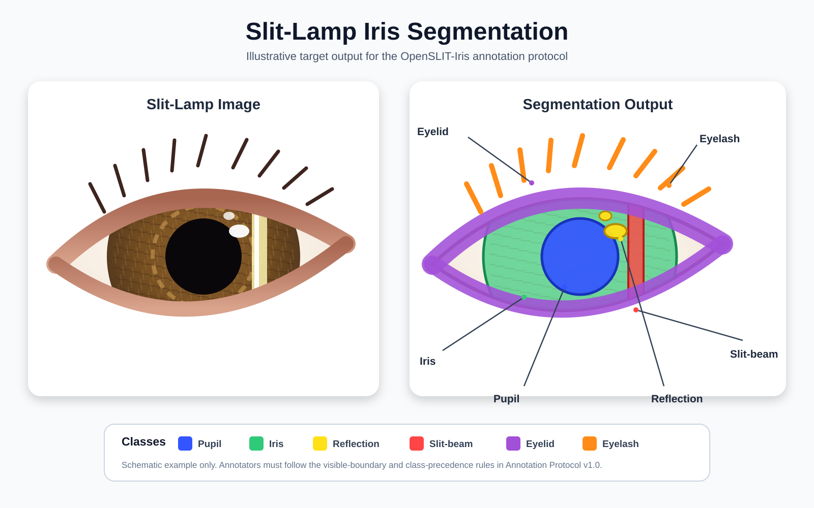

# OpenSLIT-Iris

<p align="center">
  
</p>

OpenSLIT-Iris is an open-source workflow for building reliable iris-segmentation datasets from slit-lamp photographs.

It connects:

- **Google Drive and Sheets** for image access and quality grading;
- **self-hosted CVAT** for pixel-level annotation;
- **OpenSLIT tools** for blinding, validation, disagreement analysis, AI assistance and senior adjudication.

It does not perform diagnosis.

## Collaboration workflow

```text
                         Data custodian
                              │
                   selects and aliases images
                              │
             ┌────────────────┴────────────────┐
             ▼                                 ▼
         Grader 01                         Grader 02
     private Sheet + CVAT               private Sheet + CVAT
             └────────────────┬────────────────┘
                              ▼
                    automated comparison
                              ▼
                    senior ophthalmologist
                              ▼
                   final consensus dataset
                              ▼
              AI benchmark and assisted annotation
```

The two graders work independently. They cannot see each other's Sheet or CVAT project. The senior reviews disagreements only after both submissions are frozen. Original annotations are never overwritten.

## What each person does

**Graders** review image quality in a private Google Sheet, then segment the same locked images in separate CVAT projects.

**Senior ophthalmologist** reviews both assessments, both masks, disagreement overlays and quantitative metrics, then accepts one result, creates consensus or requests a versioned revision.

**Data custodian** manages access, freezes submissions and runs the workflow commands.

## Quick start

Build the blinded pilot:

```bash
python -m openslit.collaboration build \
  --config configs/pilot_slit_dataset.json
```

Install Drive and CVAT integrations:

```bash
python -m pip install -e '.[cvat,google]'
```

Start local CVAT:

```bash
cp deployment/cvat/.env.example deployment/cvat/.env
chmod +x deployment/cvat/cvat.sh
deployment/cvat/cvat.sh up
deployment/cvat/cvat.sh create-superuser
```

Edit `configs/workflow_pilot_v1.json` with the grader accounts, senior account, CVAT usernames and Google Drive parent-folder ID.

Then run:

```bash
openslit-workflow --config configs/workflow_pilot_v1.json check
openslit-workflow --config configs/workflow_pilot_v1.json bootstrap-drive
```

After both graders finish quality grading:

```bash
openslit-workflow --config configs/workflow_pilot_v1.json freeze-grading --grader grader_01
openslit-workflow --config configs/workflow_pilot_v1.json freeze-grading --grader grader_02
openslit-workflow --config configs/workflow_pilot_v1.json setup-cvat
```

After both CVAT tasks are complete:

```bash
openslit-workflow --config configs/workflow_pilot_v1.json freeze-segmentation --grader grader_01
openslit-workflow --config configs/workflow_pilot_v1.json freeze-segmentation --grader grader_02
openslit-workflow --config configs/workflow_pilot_v1.json build-adjudication
openslit-workflow --config configs/workflow_pilot_v1.json upload-adjudication
```

## AI stage

AI remains locked until the independent human pilot and senior consensus are complete.

The AI workflow then:

1. creates participant-level train, validation and untouched test splits;
2. trains **U-Net** and **SegFormer** baselines;
3. optionally compares **nnU-Net 2D** as an external reference;
4. compares AI, Grader 01 and Grader 02 against senior consensus;
5. records uncertainty and failure cases;
6. allows a senior-approved model to pre-populate new CVAT correction tasks;
7. selects balanced active-learning batches using uncertainty, model disagreement, diversity and random controls.

Install the AI tools:

```bash
python -m pip install -e '.[ai]'
openslit-ai --config configs/ai_workflow_v1.json check --configuration-only
```

The manual pilot never shows AI masks to graders. AI-assisted annotation starts only after independent held-out evaluation and senior approval.

## Annotation classes

```text
0  background / other ocular tissue
1  pupil
2  visible iris
3  reflection
4  slit-beam artefact
5  eyelid occlusion
6  eyelash occlusion
7  uncertain / ungradable region
```

The source of truth is `configs/annotation_schema_v1.json`.

## Data protection

Never commit patient identifiers, images, credentials, submissions, masks, checkpoints, probability maps or workflow state. Aliased eye photographs remain sensitive research data.

## Documentation

- [End-to-end grader workflow](docs/END_TO_END_WORKFLOW.md)
- [AI-assisted segmentation and active learning](docs/AI_ASSISTED_SEGMENTATION.md)
- [Collaborative pilot protocol](docs/COLLABORATIVE_PILOT_PROTOCOL.md)
- [Google Drive procedure](docs/GOOGLE_DRIVE_WORKFLOW.md)
- [Local CVAT deployment](deployment/cvat/README.md)
- [Local AI runtime](deployment/ai/README.md)
- [Annotation Protocol v1.0](docs/ANNOTATION_PROTOCOL_V1.md)

## Current stage

The infrastructure is ready. The next scientific gate is to complete the two-grader pilot, freeze senior consensus masks and only then begin independent AI benchmarking and AI-assisted CVAT annotation.
