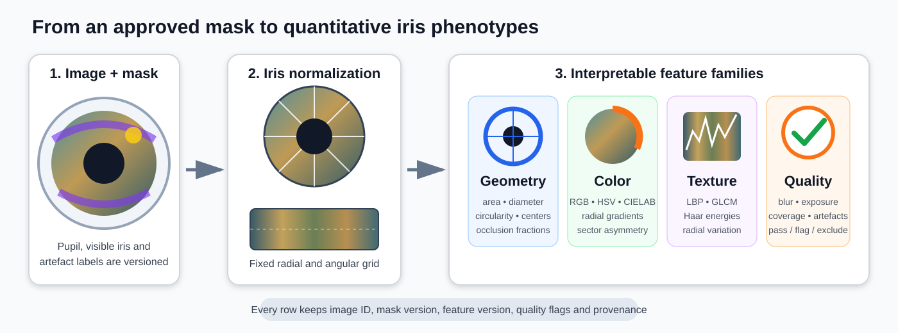

# Quantitative iris feature extraction

This stage converts a final, versioned segmentation mask into an analysis-ready table of interpretable iris measurements. It is deliberately placed **after** independent grading, senior consensus, and segmentation quality control.



## Scientific gate

Feature extraction is allowed only from one of these mask sources:

- senior consensus;
- senior-approved final mask;
- AI pre-annotation that was corrected by an ophthalmologist and accepted under the versioned workflow.

Raw, unreviewed AI output is not a valid phenotype source. Every mask must retain its image ID, mask filename, review status, gradability field, SHA-256 hash and feature version.

## What the pipeline measures

### Geometry

- pupil and visible-iris area;
- equivalent diameter and perimeter;
- circularity and eccentricity;
- centroid and orientation;
- pupil-to-iris area ratio;
- pupil–iris center displacement;
- visible-iris, reflection, slit-beam, eyelid, eyelash and uncertain-area fractions;
- approximate boundary visibility.

Pixel units are retained because physical scale is not yet guaranteed across every slit-lamp image. Millimeter conversion must be introduced only when reliable image calibration metadata or a validated scale reference is available.

### Color

Both raw and normalized measurements are retained:

- RGB, HSV and CIELAB summary statistics;
- CIELAB chroma and color spread;
- luminance and hue entropy;
- central-to-peripheral color difference;
- opposite-sector asymmetry.

The default illumination normalization is gray-world balancing. It improves comparability but does not replace a physical color-calibration target. Camera, site, illumination and acquisition settings should remain available as covariates.

### Texture

Texture is calculated only on valid iris tissue in the normalized polar strip:

- Local Binary Pattern entropy, uniform-pattern fraction and dominant-pattern fraction;
- GLCM contrast, dissimilarity, homogeneity, angular second moment, energy, entropy and correlation;
- Haar-wavelet detail energies;
- inner-versus-outer texture variation.

Reflection, slit beam, eyelid, eyelash and uncertain labels are excluded from valid texture pixels.

### Image and mask quality

- blur/sharpness through Laplacian variance;
- mean brightness and clipped dark/bright fractions;
- illumination non-uniformity;
- visible-iris pixel count;
- artefact and uncertain fractions;
- valid normalized-iris coverage;
- source review status and mask-hash verification.

Quality flags are preserved in the output rather than silently deleting difficult images.

## Iris normalization

The pupil centroid defines the polar origin. For every angle:

1. the last pupil pixel defines the inner radius;
2. the farthest visible iris pixel defines the outer radius;
3. pixels are resampled to a fixed radial and angular grid;
4. the semantic labels are resampled alongside the image;
5. only pixels labelled as visible iris enter color and texture calculations.

The default grid is 64 radial samples by 360 angular samples. Angles without both a pupil boundary and visible iris boundary remain invalid.

This is a visible-iris normalization rather than an assumption of a perfectly complete limbus. It is therefore appropriate for slit-lamp photographs with eyelid, eyelash, reflection and slit-beam occlusion, while preserving explicit coverage metrics.

## Output files

Every run creates a new immutable directory:

```text
collaboration_runs/slit_pilot_v1/features/<run_id>/
├── iris_features.csv
├── iris_features.xlsx
├── feature_quality.csv
├── feature_dictionary.csv
├── extraction_errors.csv
├── feature_run.json
├── feature_report.html
└── previews/
    └── <image_id>_feature_preview.jpg
```

`iris_features.csv` is the analysis table. `feature_quality.csv` contains detailed gate measurements and reasons for exclusion. `feature_dictionary.csv` describes every output column and its unit. The Excel workbook contains all three tables as separate sheets.

## Configuration

The default configuration is:

```text
configs/feature_extraction_v1.json
```

Important settings include:

- accepted mask review statuses;
- whether mask hashes are mandatory;
- polar-grid dimensions;
- color-normalization method;
- number of radial zones and angular sectors;
- GLCM offsets and gray levels;
- feature-quality thresholds;
- preview limits;
- Google Drive permissions.

A change in a feature definition or preprocessing rule requires a new `feature_version`.

## Commands

Validate only the repository configuration:

```bash
openslit-features --config configs/feature_extraction_v1.json \
  check --configuration-only
```

After final masks exist:

```bash
openslit-features --config configs/feature_extraction_v1.json check
```

Run extraction:

```bash
openslit-features --config configs/feature_extraction_v1.json \
  extract --run-id pilot_features_v1
```

View workflow state:

```bash
openslit-features --config configs/feature_extraction_v1.json status
```

Upload the derived tables, report and previews to the existing controlled Drive workspace:

```bash
openslit-features --config configs/feature_extraction_v1.json \
  upload-drive --run-id pilot_features_v1
```

The upload creates:

```text
OpenSLIT-Iris Pilot v1/
└── 06_Feature_Extraction/
    └── pilot_features_v1/
```

The source images and masks are not duplicated. Graders receive read access to derived feature results; the senior ophthalmologist receives write access. These roles are configurable.

## Repeatability analysis

The first scientific use of the feature table should be repeatability, not disease prediction.

Create a `repeat_group_id` that identifies repeated images of the same eye under the intended repeatability design. Then run:

```bash
openslit-features repeatability \
  --features /path/to/iris_features.csv \
  --group-column repeat_group_id \
  --output-dir /path/to/repeatability_results
```

The module reports:

- ICC(2,1): two-way random-effects, absolute-agreement, single-measure ICC;
- mean within-group coefficient of variation;
- repeatability coefficient;
- Bland–Altman bias and 95% limits of agreement for features with exactly two repeats.

Repeatability should be examined by camera, site, exposure, pupil size, image-quality category and segmentation source when the dataset supports these strata.

## Interpreting quality flags

Default flags include:

```text
UNAPPROVED_REVIEW_STATUS
NOT_GRADABLE
MISSING_MASK_SHA256
INSUFFICIENT_VISIBLE_IRIS
INSUFFICIENT_POLAR_COVERAGE
INSUFFICIENT_VALID_ANGLES
EXCESSIVE_UNCERTAIN_AREA
EXCESSIVE_ARTIFACT_AREA
LOW_SHARPNESS
EXTRACTION_ERROR
```

A flagged row remains in the audit outputs. Color and texture features are not treated as valid phenotype measurements when the feature gate fails.

Thresholds in the configuration are operational defaults for the pilot. They must be reviewed after inspecting real distributions and should not be presented as universal clinical thresholds.

## Google Drive versus local files

Use local or institutional storage as the computational source of truth. Google Drive is used for controlled collaboration and sharing of derived results.

Recommended allocation:

| Resource | Primary location |
|---|---|
| Source images and private identifiers | Approved institutional storage |
| Aliased collaboration images | Controlled Drive image folder and local working copy |
| Active segmentation annotations | Self-hosted CVAT |
| Frozen masks and workflow state | Local versioned workflow directory with backups |
| Feature tables and reports | Local run directory; optional controlled Drive upload |
| Code, schemas and configuration | GitHub |

No new external service is required. The existing Drive API and self-hosted CVAT integration are sufficient for this stage.

## Before clinical association studies

A feature may enter downstream clinical analysis only after:

1. its definition and version are frozen;
2. its source masks pass the segmentation and feature gates;
3. repeatability is quantified;
4. sensitivity to image quality, pupil size, illumination and device is assessed;
5. missingness and exclusion patterns are reported;
6. model development uses participant-level separation and an untouched test set.

This prevents acquisition artefacts and segmentation uncertainty from being misinterpreted as biological iris signal.
